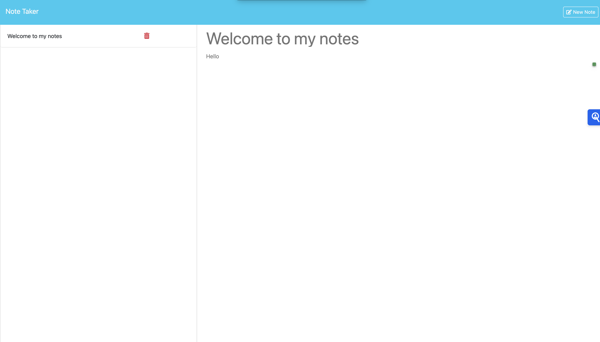

# Note Taker App

This is a simple and efficient Note Taker app that allows users to write, save, and delete notes. The app is built to practice with express.js
## Features

- **Add Notes**: Users can add new notes with a title and body.
- **Save Notes**: Save notes to be accessed later.
- **Delete Notes**: Easily remove notes when they are no longer needed.


## Technologies Used

- **Frontend**: HTML5, CSS3, JavaScript
- **Backend**: Express
- **Database**: Used db.json for this simple project
- **Hosting**: Deployed on Rended

## Installation



1. **Clone the repository:**
   ```bash
   git clone https://github.com/AntonioKOD/note_taker.git

2. **Install dependencies**
    ```bash
    npm install


3. **Run the applictaion locally**
    ```bash
    npm start

4. **Build for production**
    ```bash
    npm run build


## API Endpoints
    GET /api/notes: Retrieve all notes.
    POST /api/note: Add a new note.
    DELETE /api/notes/:id: Delete a note by ID.

## Usage

1. **Open the application in your browser or mobile device.**
2. **Create a new note by entering the note title and content, then click 'Save'.**
3. **Manage your notes by viewing, or deleting them as needed**

## Future Enhancements

1. **Tagging: Add tags to categorize and filter notes.**
2. **Search Functionality: Implement search to find notes by keywords**.
3. **Share Notes: Share notes via email or social media**


[Follow me on Github](https://github.com/AntonioKOD)


